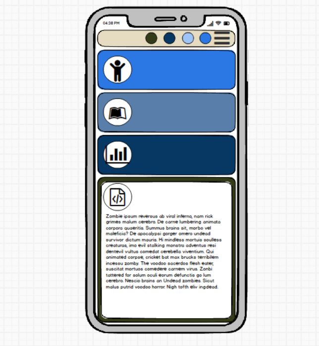
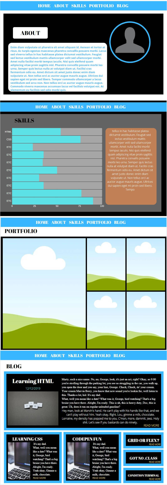
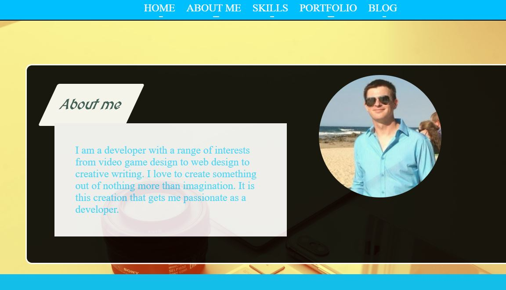
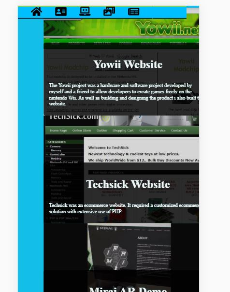
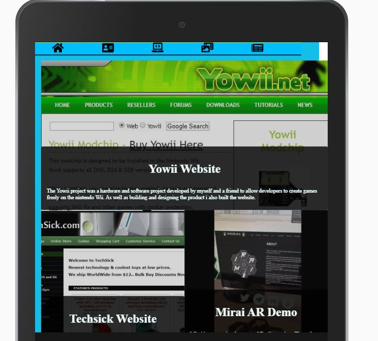
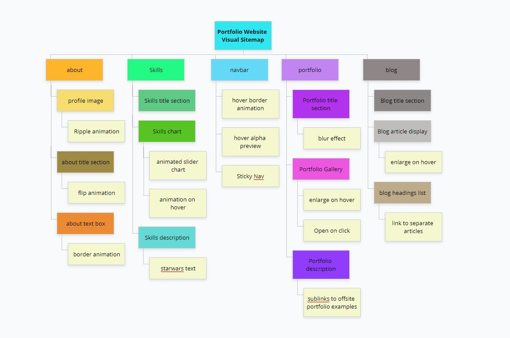

# Portfolio
[Portfolio Website Online](https://adams-coding.github.io/portfolio/)

[Github Repository for portfolio](https://github.com/adams-coding/portfolio)

### Purpose 
Create a portfolio website designed to showcase my previous work, while giving the viewer a sense of my passion and interest in a range of tech related fields.

### Target Audience
The target audience for this website includes:
- Potential employers
- Peers that may be interested in collaborative work
- Anyone that wants to know more about me or my history in tech

### Features
Features an about section, skills section, portfolio section and blog section. 
Responsive design (mostly).
#### Components

- Navigation bar

The navigation bar has links to the 4 sections of the website. 
These 4 sections display in the same page but are in fact seperate html documents.
In desktop view the links display as text.
For the mobile view i took a different path from the standard hamburger menu and replaced the text with .svg icons.
I added an animation to have the navigation bar slide in from the left.
An onhover animation catches the attention of the viewer using a unique double background offset to create the appearance of a pressed button. 
The navigation bar is sticky, so it will remain in view whether the user scrolls down the page or clicks a link. This allows for easier navigation and interaction.

- About page

The about page is called in from a separate html document to display on the index.html page.
This is done in the background without any visible sign to the user that it is taking place.
The entire about section has an animation to attract the users attention. The section will appear from the background and come around in a half circle as it increases in size and alpha.
It immediately lets the viewer know to expect a dynamic site to create interest.

The "about me' h1 title has a hover effect to maintain the dynamic nature of the site.

The introduction paragraph has a hover effect to slightly enlarge and change color.

The profile image has a hover transition to zoom the image while removing border to maintain the dimensions.

- Skills Page

The skills page features a horizontal skills chart that animates on loading.
The skills bar is percentage based with a number of transforms and animations applied to it.

On hover it performs a further animation. This is designed to remind the user that skill levels are fluid rather than fixed.

The skills page also has a writeup on further skills that may be interesting to prospective employers.

- Portfolio page

The portfolio page contains a component giving a brief introduction to my interest in coding and previous projects i've completed.

The major component of the portfolio page is the image gallery of previous work. Its features include a semi transparent color overlay with text area overlaying the image to proide a summary description of each project. Each image is clickable to an external website.

On hover the size of each image component increases to provide interest and easier viewing.

- Blog page

The blog page contains an animated h1 element element creating the appearance that the element is drifting up and down.

It is contained within another element that uses inset and external border shadows to provide the illusion of depth.

The blog section itself shows articles with a background image, plus color and text overlay.

On hover the selected component will increase in brightness and enlarge.

-Footer 

The footer is a match for the nav bar at the top of the page to complete the overall design. 
It includes links for social pages and email contact.

### Wireframes

The following are wireframes designed for mobile and desktop.

 - Mobile
The focus with mobile was a simple design that is more about showing information than adding effects.

While i didn't follow the wireframe to the letter it game me a starting base to work from.

- Desktop

The desktop wireframe was much more detailed, including a complete mockup of all pages.
I made substantial changes to the details of the site, but the overall layout was fairly similar to the one originally envisioned.

### The Website

Below are screenshots of the website itself. The design has changed since these images were taken.

- Desktop

- Mobile

- Tablet

### Sitemap
As part of the design process i created a visual sitemap similar to a software development plan for a clearer understanding of the layout and interaction of the site. The website will present as a single page layout, but to fulfil the requirements of at least four html documents, each page will be called into the index as an iframe, then the iframe removed prior to display to prevent issues such as scrolling windows within the page.
The seperate html documents that are called into the main page are: 
- about.html
- skills.hml
- portfolio.html
- blog.html

The primary method for creating a dynamic and interactive site are the use of transition/ transform animations with both on load and on hover events.

I have also generated both html and xml sitemaps.
You can find them here:

 - [HTML SITEMAP](https://github.com/adams-coding/portfolio/sitemp.html)

 - [XML SITEMAP](https://github.com/adams-coding/portfolio/sitemap.xml)

### Tech stack

The site was built using html5 and css in vscode, uploaded and deployed to github.